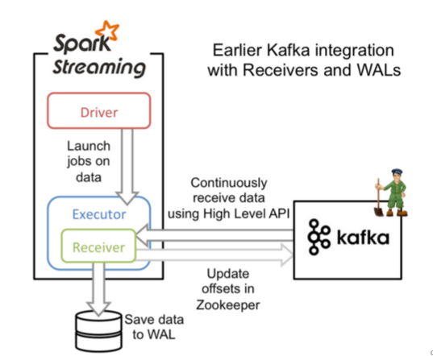
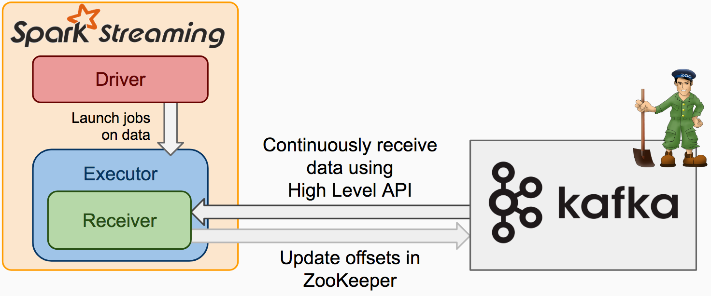
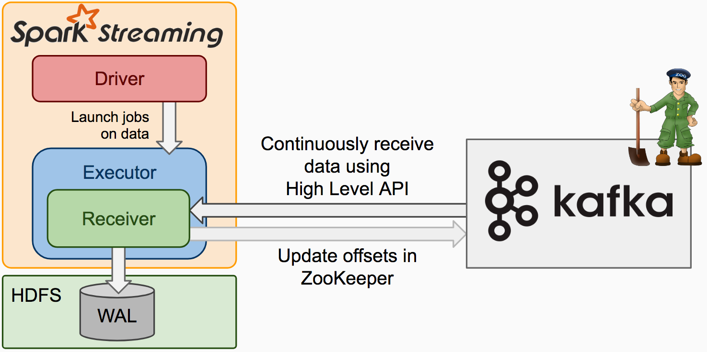
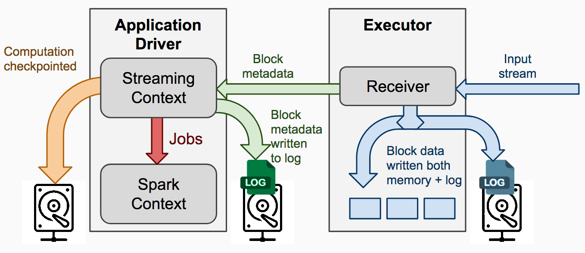
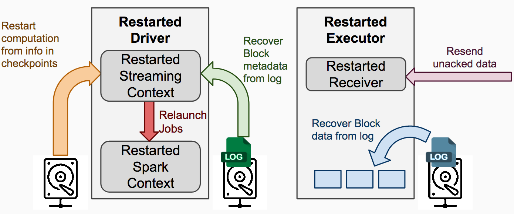
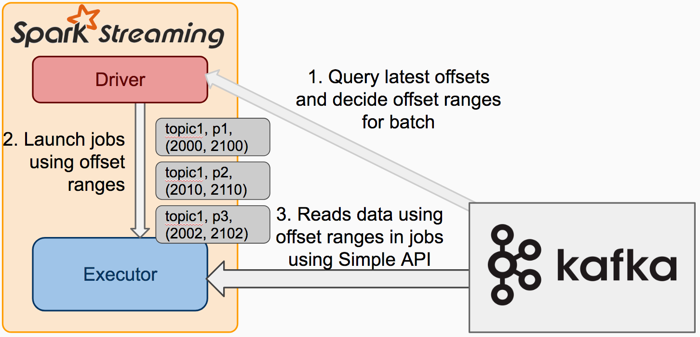

## 小目标


## 常见处理
1. spark Streaming==> spark core

2. spark Streaming => spark core & spark SQl

## 0.8.2-receiverBased

### 简介
基于receiver的方式主要是使用kafka high-level 消费者api实现的，具有消费组的概念，也即是多个receiver可以位于同一个消费者组，共同完成一份数据的消费。

receiver会被driver调度到executor，然后作为一个常驻线程执行，主要负责从kafka接受数据，然后写入blockmanager(200ms生成一个block)，然后job生成的时候
构建blockrdd，最终以spark core任务的形式运行。



### 接收器可靠性

根据其可靠性，可以有两种数据源。 来源（如Kafka和Flume）允许传输完成的数据得到确认。 
如果从这些可靠来源接收数据的系统正确地确认接收到的数据，则可以确保不会因任何类型的故障而丢失数据。 两种接收器：

* 可靠的接收器 - 可靠的接收器在接收到数据并通过复制存储在Spark中时正确地向可靠的源发送确认。

* 不可靠的接收器 - 不可靠的接收器不会向源发送确认。 这可以用于不支持确认的源，甚至可以用于不需要或需要进入确认复杂性的可靠源。

[自定义receiver](http://spark.apache.org/docs/latest/streaming-custom-receivers.html)

### checkpoint

[checkpoint](https://mp.weixin.qq.com/s/dC321L_yMG-SwhH6Zw62Hw)
注意事项：
1. 广播变量和累加器不能从checkpoint恢复

广播变量和累加器是不能从checkpoint恢复的，所以要想从checkpoint要实现一个单实例
```scala
object WordBlacklist {

  @volatile private var instance: Broadcast[Seq[String]] = null

  def getInstance(sc: SparkContext): Broadcast[Seq[String]] = {
    if (instance == null) {
      synchronized {
        if (instance == null) {
          val wordBlacklist = Seq("a", "b", "c")
          instance = sc.broadcast(wordBlacklist)
        }
      }
    }
    instance
  }
}

object DroppedWordsCounter {

  @volatile private var instance: LongAccumulator = null

  def getInstance(sc: SparkContext): LongAccumulator = {
    if (instance == null) {
      synchronized {
        if (instance == null) {
          instance = sc.longAccumulator("WordsInBlacklistCounter")
        }
      }
    }
    instance
  }
}
```

2. checkpoint 频率

 5 - 10倍的滑动间隔，而不是batch时间。
 
 `Dtream.checkpoint(checkpointInterval)`

### wal

原始


容错



保存wal


从wal中恢复



开启 只需设置spark.streaming.receiver.writeAheadLog.enable为true，默认是false。

spark.streaming.driver.writeAheadLog.closeFileAfterWrite
默认是false，是否在写了一次wal之后关闭文件。对于不支持flush的文件系统，比如s3做driver的元数据wal，需要将该值设置为true。

spark.streaming.driver.writeAheadLog.closeFileAfterWrite	
默认是false，是否在写了一次wal之后关闭文件。对于不支持flush的文件系统，比如s3做receiver的数据wal，需要将该值设置为true。

### backpressure

[backpressure](https://mp.weixin.qq.com/s/x5ygKw6Rx7EH1AZqCL_BNA)

1. spark.streaming.backpressure.enabled

默认是false，设置为true，就开启了背压机制。

2. spark.streaming.backpressure.initialRate

默认没设置，初始速率。第一次启动的时候每个receiver接受数据的最大值。

3. spark.streaming.receiver.maxRate

默认值没设置。每个接收器将接收数据的最大速率（每秒记录数）。 
实际上，每个流每秒最多将消费此数量的记录。 
将此配置设置为0或负数将不会对速率进行限制。

4. spark.streaming.kafka.maxRatePerPartition

使用新Kafka direct API时从每个Kafka分区读取数据的最大速率（每秒记录数）。


### 其他配置
1. spark.streaming.blockInterval

默认值是200ms。最小建议是50ms，小于该值，性能不好，比如task加载比重就比较大了。
每秒钟大于50个任务，那么将任务加载分发执行就会成为一种负担。

2. spark.streaming.stopGracefullyOnShutdown	（优雅停止）

默认是false。设置为true会温柔停止StreamingContext。
可以考虑 yarn -kill的时候会温柔停止吗？不会

3. spark.streaming.ui.retainedBatches

默认值是1000。在垃圾回收之前会保留多少个批次记录。

4. spark.streaming.kafka.maxRetries

默认值是1。查找kafka leader的时候尝试的次数。

5. spark.streaming.unpersist

默认值是true. 强制将spark streaming产生的rdd或者缓存的rdd从内存中移除。
spark streaming接收的原始数据也会被移除。
将其设置为false，
会使得原始数据和缓存的rdd在spark 在spark streaming外部使用。
肯定会消耗更多的内存。

### 要点：

1. Kafka中的topic分区与Spark Streaming中生成的RDD分区无关 

因此，增加KafkaUtils.createStream()中特定于topic的分区的数量只会增加使用单个receiver中使用的topic的线程数()。 
它不会增加Spark在处理数据时的并行性。 有关详细信息，请参阅主文档。

2. 可以使用不同的组和topic创建多个Kafka输入DStream，以使用多个receiver并行接收数据

3. 如果已使用HDFS等副本文件系统启用了wal，则接收的数据已在日志中复制

因此，输入流的存储级别设置为StorageLevel.MEMORY_AND_DISK_SER
（即，使用KafkaUtils.createStream（...，StorageLevel.MEMORY_AND_DISK_SER)），无需增加副本。

## 0.8.2-direct Stream

### 简介
实际上对于0.8.2.2 用的是simple conusmer，负责从kafka里没获取一定offset范围的数据。



优于基于receiver的地方：

1. 简化并行：无需创建多个输入Kafka流并将它们union起来。使用directStream，Spark Streaming将创建与要使用的Kafka分区一样多的RDD分区，这些分区将并行地从Kafka读取数据。
因此，Kafka和RDD分区之间存在一对一的映射，这更容易理解和调优。
        
2. 效率：在recevier based方法中实现零数据丢失需要将数据存储在Write Ahead Log中，这进一步复制了数据。这实际上是低效的，因为数据被复制两次 一次由Kafka复制，第二次由Write Ahead Log复制。
第二种方法消除了问题，因为没有接收器，因此不需要Write Ahead Logs。只要kafka有足够的保留，就可以从Kafka恢复消息。
        
3. 完全一次的语义：receiver based方法使用Kafka的高级API在Zookeeper中存储消耗的偏移量。这是从Kafka消费数据传统的方式。
虽然这种方法（与预写日志结合使用）可以确保零数据丢失（即至少一次语义），但某些记录在某些故障下可能会被消耗两次。
这是因为Spark Streaming可靠接收的数据与Zookeeper跟踪的偏移之间存在不一致。因此，在direct stream中，我们使用不用Zookeeper的简单Kafka API。 
Spark Streaming在其checkpoint内跟踪偏移量。这消除了Spark Streaming和Zookeeper / Kafka之间的不一致，因此尽管出现故障，Spark Streaming也会有效地接收每条记录一次。
为了实现输出结果的一次性语义，将数据保存到外部数据存储的输出操作必须是幂等的，或者是保存结果和偏移的原子事务。

### 输出操作的语义
输出操作（如foreachRDD）至少具有一次语义，也就是说，在工作者发生故障时，转换后的数据可能会多次写入外部实体。
虽然使用saveAs *** Files操作保存到文件系统是可以接受的（因为文件只会被相同的数据覆盖），但是可能需要额外的努力来实现一次性语义。
有两种方法。

1. 幂等更新：多次尝试始终写入相同的数据。例如，saveAs *** Files始终将相同的数据写入生成的文件。

2. 事务性更新：所有更新都是以事务方式进行的，以便以原子方式完成更新。一种方法是：
使用批处理时间（在foreachRDD中可用）和RDD的分区索引来创建标识符。该标识符唯一地标识流应用程序中的blob数据。
使用标识符以事务方式（即，仅一次，原子地）使用此blob更新外部系统。也就是说，如果标识符尚未提交，则以原子方式提交分区数据和标识符。否则，如果已经提交，请跳过更新。
```java
dstream.foreachRDD { (rdd, time) =>
  rdd.foreachPartition { partitionIterator =>
    val partitionId = TaskContext.get.partitionId()
    val uniqueId = generateUniqueId(time.milliseconds, partitionId)
    // use this uniqueId to transactionally commit the data in partitionIterator
  }
}
```

## 0.10.2.2-direct stream

### LocationStrategies(本地策略)

新版本的消费者API会预取消息入buffer。因此，为了提升性能，在Executor端缓存消费者(而不是每个批次重新创建)是非常有必要的，优先调度那些分区到已经有了合适消费者主机上。

在很多情况下，你需要像上文一样使用LocationStrategies.PreferConsistent，这个参数会将分区尽量均匀地分配到所有的可以Executor上去。
如果，你的Executor和kafka broker在同一台机器上，可以用PreferBrokers，这将优先将分区调度到kafka分区leader所在的主机上。
最后，分区间负荷有明显的倾斜，可以用PreferFixed。这个允许你指定一个明确的分区到主机的映射（没有指定的分区将会使用连续的地址）。

消费者缓存的数目默认最大值是64。如果你希望处理超过（64*excutor数目）kafka分区，spark.streaming.kafka.consumer.cache.maxCapacity这个参数可以帮助你修改这个值。

如果你想禁止kafka消费者缓存，可以将spark.streaming.kafka.consumer.cache.enabled修改为false。禁止缓存缓存可能需要解决SPARK-19185描述的问题。
一旦这个bug解决，这个属性将会在后期的spark版本中移除。


Cache是按照topicpartition和groupid进行分组的，所以每次调用creaDirectStream的时候要单独设置group.id。

### ConsumerStrategies(消费策略)

新的kafka消费者api有多个不同的方法去指定消费者，其中有些方法需要考虑post-object-instantiation设置。
ConsumerStrategies提供了一个抽象，它允许spark能够获得正确配置的消费者，即使从Checkpoint重启之后。

ConsumerStrategies.Subscribe，如上面展示的一样，允许你订阅一组固定的集合的主题。SubscribePattern允许你使用正则来指定自己感兴趣的主题。
注意，跟0.8整合不同的是，使用subscribe或者subscribepattern在运行stream期间应对应到添加分区。
其实，Assign运行你指定固定分区的集合。这三种策略都有重载构造函数，允许您指定特定分区的起始偏移量。

ConsumerStrategy是一个public类，允许你进行自定义策略。

##

1。 存活监控及拉起

```
#!/bin/bash
. /etc/profile
localIp=`ifconfig|grep "inet addr:"|grep -v "127.0.0.1"|cut -d: -f2|awk '{print $1}'`
monitorIp=`head -1 /data/shell/monitorIp.conf`
ARR=(InnerCmdInjectionRulesEngine)
for app in ${ARR[*]}
do
{
        name=`yarn application -list | grep $app | awk '{print $2}' | cut -d \. -f 3`
        if [ $app = $name ] ; then
                msg=$name"-is-alive!-ip="
                url=$monitorIp${msg}$localIp
#               curl -d "" $url
        else
                msg=$name"-has-errors!-ip="
                url=${monitorIp}${msg}${localIp}
                curl -d "" $url
                script="/data/uescStreaming/"$name".sh"
                bash $script
        fi
} &
done
sleep 30
```

2. listener 监控

## 升级代码

1. 同步启动

2. 温柔停止

